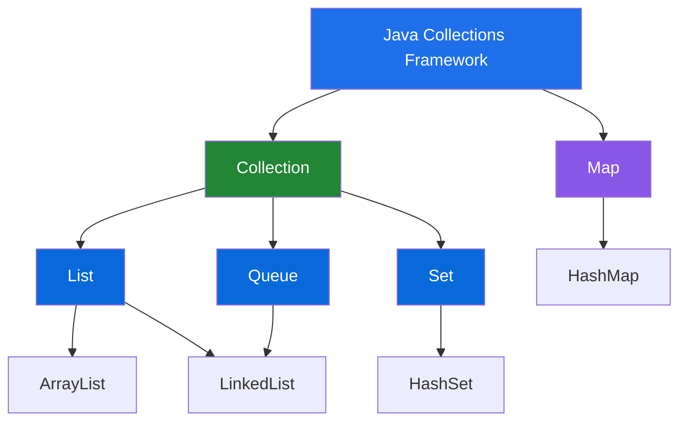
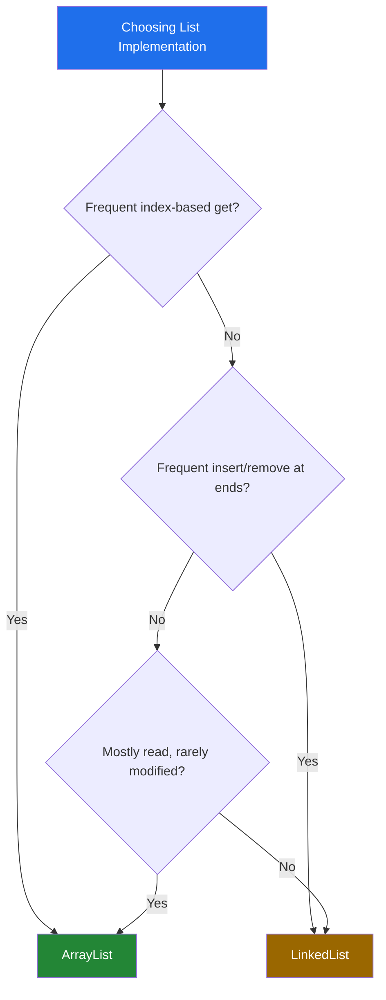
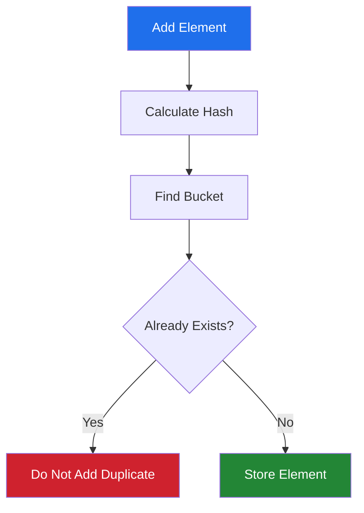
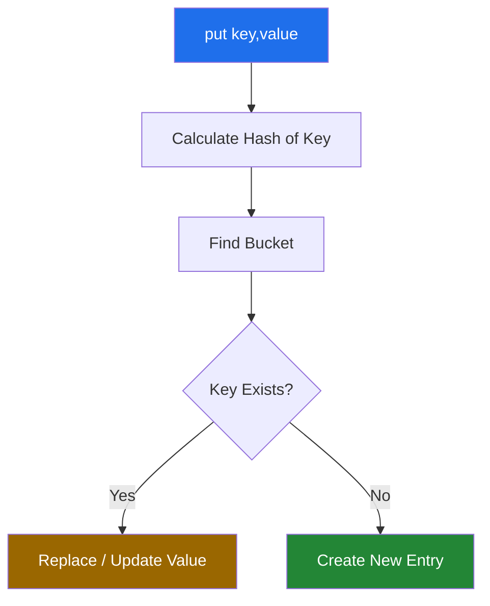
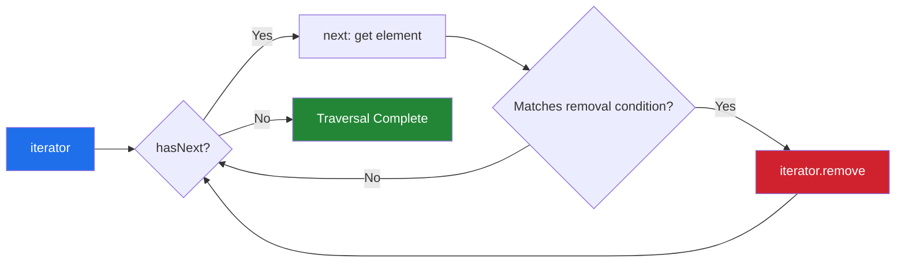
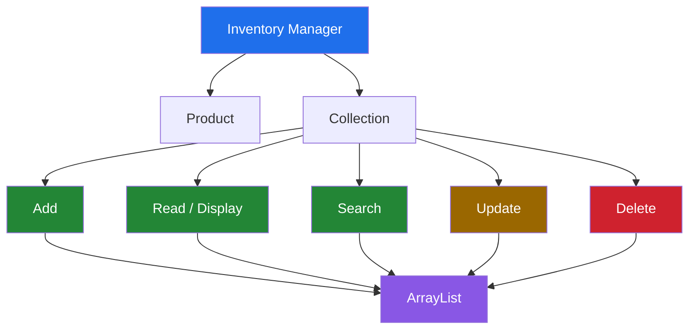
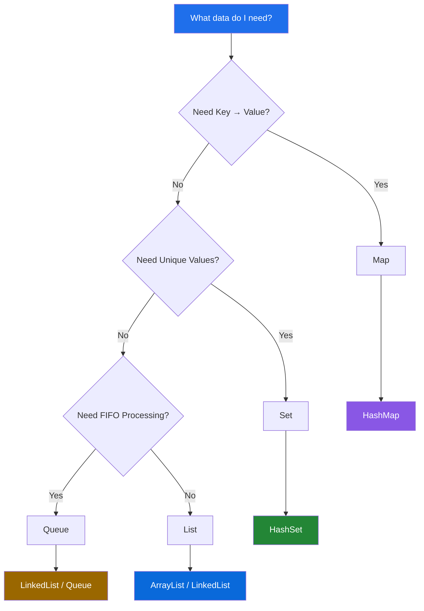

<div align="center">


[](https://git.io/typing-svg)


</div> 


Part of the **[JAVA-30-day-BootCamp](../)** series — a self-directed, 30-day journey through Core Java, building toward OOP, Collections, Streams, JDBC, and Spring Boot.

<div align="center">

**Mastering Java Collections: `List`, `Set`, `Map`, `Queue` and their implementations**

</div>

---

## 📖 Table of Contents

<details open>
<summary>Click to expand / collapse</summary>

1. [Day 13 Overview](#-day-13-overview)
2. [What is a Collection?](#-1-what-is-a-collection)
3. [Java Collections Framework](#️-2-java-collections-framework)
4. [Interface vs Implementation](#-3-interface-vs-implementation)
5. [List](#-4-list)
6. [ArrayList](#-6-arraylist)
7. [LinkedList](#-7-linkedlist)
8. [ArrayList vs LinkedList](#️-8-arraylist-vs-linkedlist)
9. [Set & HashSet](#-9-set)
10. [Map & HashMap](#️-13-map)
11. [Queue](#-18-queue)
12. [Iterator](#-21-iterator)
13. [CRUD Operations](#-23-crud-operations)
14. [Inventory Manager Project](#-24-inventory-manager)
15. [Choosing the Correct Data Structure](#-26-choosing-the-correct-data-structure)
16. [Time Complexity Cheat Sheet](#-28-time-complexity-cheat-sheet)
17. [Interview Questions](#-30-important-interview-questions)
18. [Day 13 Summary](#-day-13-summary)

</details>

---

## 📌 Day 13 Overview

Day 13 focuses on one of the most important areas of Core Java:

> **Java Collections Framework**

Collections provide ready-made data structures and algorithms for
storing, searching, updating, removing, and processing groups of
objects.

### Today's Core Topics

-   Collection Framework
-   `Collection` interface
-   `List`
-   `ArrayList`
-   `LinkedList`
-   `Set`
-   `HashSet`
-   `Map`
-   `HashMap`
-   `Queue`
-   Iteration
-   `Iterator`
-   CRUD operations
-   Searching
-   Removing elements safely
-   Interface vs implementation
-   Time complexity
-   Choosing the right collection
-   Inventory Manager mini-project

------------------------------------------------------------------------

# 🧠 1. What is a Collection?

A **collection** is an object that is used to store and manipulate a
group of objects.

For example, instead of creating separate variables:

```java
String product1 = "Laptop";
String product2 = "Mouse";
String product3 = "Keyboard";
```

we can use:

```java
List<String> products = new ArrayList<>();

products.add("Laptop");
products.add("Mouse");
products.add("Keyboard");
```

This makes it easier to:

-   Add elements
-   Remove elements
-   Search elements
-   Update elements
-   Traverse elements
-   Sort elements
-   Store dynamic amounts of data

------------------------------------------------------------------------

# 🏗️ 2. Java Collections Framework

The **Java Collections Framework (JCF)** is a unified architecture for
representing and manipulating collections.

## High-Level Architecture



### ⭐ Important

`Map` is part of the Collections Framework, but **Map does not extend
`Collection`**.

```text
Collection
 ├── List
 ├── Set
 └── Queue

Map
 ├── HashMap
 ├── LinkedHashMap
 └── TreeMap
```

------------------------------------------------------------------------

# 🔑 3. Interface vs Implementation

One of the most important Java concepts is understanding the difference
between an interface and a class.

### Interface

Defines **what operations are available**.

Examples:

```java
List
Set
Queue
Map
```

### Implementation

Defines **how those operations are actually performed**.

Examples:

```java
ArrayList
LinkedList
HashSet
HashMap
```

### Recommended style

```java
List<String> names = new ArrayList<>();
Set<Integer> ids = new HashSet<>();
Map<Integer, String> students = new HashMap<>();
Queue<String> tasks = new LinkedList<>();
```

Think:

```text
INTERFACE              IMPLEMENTATION

List       ----------> ArrayList
                         LinkedList

Set        ----------> HashSet

Queue      ----------> LinkedList

Map        ----------> HashMap
```

------------------------------------------------------------------------

# 📋 4. LIST

## Definition

> **List is an ordered collection that allows duplicate elements and
> provides index-based access.**

Example:

```java
List<String> names = new ArrayList<>();

names.add("Vamsi");
names.add("Rahul");
names.add("Vamsi");

System.out.println(names);
```

Output:

```text
[Vamsi, Rahul, Vamsi]
```

The duplicate `"Vamsi"` is allowed.

## List Characteristics

  Feature                  List
  ------------------------ -----------------------
  Maintains order          ✅
  Allows duplicates        ✅
  Index-based access       ✅
  Key-value structure      ❌
  Common implementations   ArrayList, LinkedList

------------------------------------------------------------------------

# 🧰 5. List Important Methods

```java
add(element)
add(index, element)
get(index)
set(index, element)
remove(index)
remove(object)
contains(object)
indexOf(object)
lastIndexOf(object)
size()
isEmpty()
clear()
```

### Example

```java
List<String> names = new ArrayList<>();

names.add("Java");
names.add("Python");

System.out.println(names.get(0));

names.set(0, "C++");

names.remove("Python");

System.out.println(names.contains("C++"));
System.out.println(names.size());
```

------------------------------------------------------------------------

# 🧱 6. ARRAYLIST

## Definition

> **ArrayList is a resizable-array implementation of the `List`
> interface.**

Normal array:

```java
String[] names = new String[5];
```

The size is fixed.

ArrayList:

```java
ArrayList<String> names = new ArrayList<>();
```

The collection grows dynamically.

## Internal Concept

```text
ArrayList

Index       0        1        2        3
          ┌──────┬──────┬──────┬──────┐
          │ Java │ SQL  │ HTML │ CSS  │
          └──────┴──────┴──────┴──────┘
```

When capacity is insufficient, ArrayList grows its internal storage.

## ArrayList Example

```java
import java.util.ArrayList;

public class ArrayListExample {

    public static void main(String[] args) {

        ArrayList<String> languages = new ArrayList<>();

        // CREATE
        languages.add("Java");
        languages.add("Python");
        languages.add("SQL");

        // READ
        System.out.println(languages.get(0));

        // UPDATE
        languages.set(1, "C++");

        // DELETE
        languages.remove("SQL");

        // SEARCH
        System.out.println(languages.contains("Java"));

        // SIZE
        System.out.println(languages.size());

        // DISPLAY
        System.out.println(languages);
    }
}
```

------------------------------------------------------------------------

# 🔗 7. LINKEDLIST

## Definition

> **LinkedList is a doubly-linked implementation of the `List` and
> `Deque` interfaces.**

Each node conceptually stores:

```text
┌────────┬────────┬────────┐
│  prev  │  data  │  next  │
└────────┴────────┴────────┘
```

Example:

```text
NULL
  ↓
[10] ⇄ [20] ⇄ [30] ⇄ [40]
                         ↓
                        NULL
```

Unlike ArrayList, LinkedList does not need elements to be stored in one
contiguous array.

## LinkedList Example

```java
import java.util.LinkedList;

public class LinkedListExample {

    public static void main(String[] args) {

        LinkedList<String> list = new LinkedList<>();

        list.add("Java");
        list.add("Python");
        list.add("SQL");

        list.addFirst("C++");
        list.addLast("JavaScript");

        System.out.println(list);

        System.out.println(list.getFirst());
        System.out.println(list.getLast());

        list.removeFirst();
        list.removeLast();

        System.out.println(list);
    }
}
```

------------------------------------------------------------------------

# ⚔️ 8. ArrayList vs LinkedList

  Feature              ArrayList                LinkedList
  -------------------- ------------------------ ---------------------
  Internal structure   Dynamic array            Doubly linked nodes
  Random access        Fast                     Slow
  `get(index)`         O(1)                     O(n)
  Add at end           Usually O(1) amortized   O(1)
  Memory overhead      Lower                    Higher
  Add/remove at ends   Good                     Excellent
  Implements List      ✅                       ✅
  Implements Deque     ❌                       ✅

### Practical Rule — Decision Flow



------------------------------------------------------------------------

# 🎯 9. SET

## Definition

> **Set is a collection that does not allow duplicate elements.**

Example:

```java
Set<Integer> numbers = new HashSet<>();

numbers.add(10);
numbers.add(20);
numbers.add(10);
numbers.add(30);
```

The result contains only unique values.

```text
10
20
30
```

## Set Characteristics

  Feature                 Set
  ----------------------- ---------
  Duplicates              ❌
  Index                   ❌
  Key-value               ❌
  Uniqueness              ✅
  Common implementation   HashSet

------------------------------------------------------------------------

# 🛡️ 10. HASHSET

## Definition

> **HashSet is a hash-table-based implementation of the `Set` interface
> that stores unique elements.**

Example:

```java
HashSet<String> skills = new HashSet<>();

skills.add("Java");
skills.add("SQL");
skills.add("Java");

System.out.println(skills);
```

`Java` appears only once.

### ⚠️ Important

HashSet does **not guarantee insertion order**.

Do not write logic that depends on the displayed order.

------------------------------------------------------------------------

# 🔄 11. HashSet Working Flow



------------------------------------------------------------------------

# 🧰 12. HashSet Methods

```java
add()
remove()
contains()
size()
isEmpty()
clear()
addAll()
removeAll()
retainAll()
```

### Example

```java
HashSet<Integer> numbers = new HashSet<>();

numbers.add(10);
numbers.add(20);
numbers.add(30);
numbers.add(10);

System.out.println(numbers);

System.out.println(numbers.contains(20));

numbers.remove(20);

System.out.println(numbers.size());
```

------------------------------------------------------------------------

# 🗺️ 13. MAP

## Definition

> **Map stores data as key-value pairs where each key is unique.**

Example:

```text
101 → Vamsi
102 → Rahul
103 → Kiran
```

Here:

```text
101 = key
Vamsi = value
```

### Map Characteristics

  Feature                 Map
  ----------------------- ---------
  Key-value pairs         ✅
  Duplicate keys          ❌
  Duplicate values        ✅
  Index-based             ❌
  Search by key           ✅
  Common implementation   HashMap

------------------------------------------------------------------------

# 🔑 14. HashMap

## Definition

> **HashMap is a hash-table-based implementation of the `Map` interface
> that stores key-value pairs.**

Example:

```java
HashMap<Integer, String> students = new HashMap<>();

students.put(101, "Vamsi");
students.put(102, "Rahul");
students.put(103, "Kiran");
```

Structure:

```text
Key       Value

101  →   Vamsi
102  →   Rahul
103  →   Kiran
```

### Duplicate Key

```java
students.put(101, "Arjun");
```

The value for key `101` becomes `"Arjun"`.

It does not create a second `101`.

------------------------------------------------------------------------

# 🔄 15. HashMap Working Flow



------------------------------------------------------------------------

# 🧰 16. HashMap Methods

```java
put()
get()
remove()
containsKey()
containsValue()
size()
isEmpty()
clear()
keySet()
values()
entrySet()
```

### Example

```java
HashMap<Integer, String> students = new HashMap<>();

students.put(101, "Vamsi");
students.put(102, "Rahul");

System.out.println(students.get(101));

students.put(101, "Arjun");

System.out.println(students.containsKey(102));

students.remove(102);

System.out.println(students.keySet());
System.out.println(students.values());
```

------------------------------------------------------------------------

# 🔁 17. Iterating Through HashMap

The most useful approach is `entrySet()`.

```java
for (Map.Entry<Integer, String> entry : students.entrySet()) {

    System.out.println(
        entry.getKey() + " -> " + entry.getValue()
    );
}
```

You can also use:

```java
for (Integer key : students.keySet()) {
    System.out.println(key);
}
```

or:

```java
for (String value : students.values()) {
    System.out.println(value);
}
```

------------------------------------------------------------------------

# 🚶 18. QUEUE

## Definition

> **Queue is a collection designed for processing elements in a
> particular order, commonly FIFO --- First In, First Out.**

Real-world example:

```text
Customer 1 → Customer 2 → Customer 3
     ↓
Customer 1 is served first
```

## Queue Structure

```text
FRONT                              REAR
  ↓                                  ↓
[10] → [20] → [30] → [40]
  ↑                                  ↑
 remove                              add
```

------------------------------------------------------------------------

# 🔑 19. Queue Methods

### Insert

```java
add()
offer()
```

### Remove

```java
remove()
poll()
```

### Examine front

```java
element()
peek()
```

## Important Difference

  Operation   Method        Empty Queue
  ----------- ------------- -----------------------------
  Insert      `add()`       Throws exception on failure
  Insert      `offer()`     Returns failure value
  Remove      `remove()`    Throws exception
  Remove      `poll()`      Returns `null`
  View        `element()`   Throws exception
  View        `peek()`      Returns `null`

For everyday queue processing, `offer()`, `poll()`, and `peek()` are
commonly preferred.

------------------------------------------------------------------------

# 🔄 20. Queue Flow


------------------------------------------------------------------------

# 🧹 21. ITERATOR

## Definition

> **Iterator is an object used to traverse elements of a collection one
> by one.**

Basic usage:

```java
Iterator<String> iterator = names.iterator();

while (iterator.hasNext()) {

    String name = iterator.next();

    System.out.println(name);
}
```

### Important Iterator Methods

```java
hasNext()
next()
remove()
```

## 🔄 Iterator Traversal Cycle



------------------------------------------------------------------------

# ⚠️ 22. Why Iterator Matters

Suppose we want to remove elements while traversing.

Avoid this pattern:

```java
for (String name : names) {

    if (name.equals("Vamsi")) {
        names.remove(name);
    }
}
```

This can result in `ConcurrentModificationException`.

Use an Iterator:

```java
Iterator<String> iterator = names.iterator();

while (iterator.hasNext()) {

    String name = iterator.next();

    if (name.equals("Vamsi")) {
        iterator.remove();
    }
}
```

This is an important practical Java Collections concept.

------------------------------------------------------------------------

# 🧮 23. CRUD Operations

CRUD means:

```text
C → Create
R → Read
U → Update
D → Delete
```

Collections support these operations in different ways.

### ArrayList

```java
products.add(product);        // CREATE
products.get(index);          // READ
products.set(index, product); // UPDATE
products.remove(index);       // DELETE
```

### HashSet

```java
products.add(product);        // CREATE
products.contains(product);   // READ / SEARCH
// Update usually means remove + add
products.remove(product);     // DELETE
```

### HashMap

```java
products.put(id, product);    // CREATE / UPDATE
products.get(id);             // READ
products.put(id, newProduct); // UPDATE
products.remove(id);          // DELETE
```

------------------------------------------------------------------------

# 🛒 24. Inventory Manager

The Day 13 exercise applies Collections to a real-world problem.

### Product

```text
Product
 ├── id
 ├── name
 ├── price
 └── quantity
```

### InventoryManager

```text
InventoryManager
       │
       ↓
ArrayList<Product>
       │
 ┌─────┼─────────┐
 ↓     ↓         ↓
Add   Display   Search
       │
       ↓
     Update
       │
       ↓
     Remove
```

------------------------------------------------------------------------

# 🏗️ 25. Inventory Manager Architecture



------------------------------------------------------------------------

# 🧩 26. Choosing the Correct Data Structure

Use this decision flow:



------------------------------------------------------------------------

# 🧠 27. The Four Words to Remember

If you forget everything else, remember:

```text
LIST  → ORDER
SET   → UNIQUE
MAP   → KEY → VALUE
QUEUE → FIFO
```

### Implementation memory trick

```text
LIST
 ├── ArrayList
 └── LinkedList

SET
 └── HashSet

MAP
 └── HashMap

QUEUE
 └── LinkedList
```

------------------------------------------------------------------------

# ⚡ 28. Time Complexity Cheat Sheet

Average-case/basic interview view:

  Operation        ArrayList   LinkedList   HashSet   HashMap
  -------------- ----------- ------------ --------- ---------
  Get by index          O(1)         O(n)       ---       ---
  Search                O(n)         O(n)    O(1)\*    O(1)\*
  Add                 O(1)\*     O(1)\*\*    O(1)\*    O(1)\*
  Remove                O(n)   O(n)\*\*\*    O(1)\*    O(1)\*

`*` Average/amortized case.\
`**` Adding at an already-known end/node position.\
`***` Arbitrary LinkedList removal includes locating the element.

Do not memorize the table without understanding the underlying
structure.

------------------------------------------------------------------------

# 📊 29. Complete Comparison

  --------------------------------------------------------------------------------
  Feature      ArrayList   LinkedList   HashSet      HashMap      Queue
  ------------ ----------- ------------ ------------ ------------ ----------------
  Interface    List        List/Deque   Set          Map          Queue

  Ordered      Yes         Yes          No           No           Yes by
                                        guaranteed   guaranteed   processing order
                                        order        order        

  Duplicates   Yes         Yes          No           Keys: No     Usually yes

  Index        Yes         Yes          No           No           No

  Key-value    No          No           No           Yes          No

  Main purpose General     Linked list  Unique data  Key-value    FIFO processing
               list        / deque                   lookup       

  Null         Allows      Allows       Allows one   Allows one   Depends on
                                        null         null key     implementation
  --------------------------------------------------------------------------------

------------------------------------------------------------------------

# 🎯 30. Important Interview Questions

### Beginner

1.  What is Java Collections Framework?
2.  What is a collection?
3.  Difference between Collection and Collections?
4.  Difference between List, Set and Map?
5.  Why does Map not extend Collection?
6.  What is ArrayList?
7.  What is LinkedList?
8.  What is HashSet?
9.  What is HashMap?
10. What is Queue?

### Intermediate

11. ArrayList vs LinkedList?
12. HashSet vs ArrayList?
13. HashMap vs HashSet?
14. Why doesn't HashSet allow duplicates?
15. How does HashMap work internally?
16. What happens when duplicate key is inserted into HashMap?
17. What is the difference between `add()` and `offer()`?
18. Difference between `remove()` and `poll()`?
19. Difference between `peek()` and `element()`?
20. Why use `Iterator`?

### Important Interview Questions

21. How does hashing work?
22. What are `hashCode()` and `equals()`?
23. Why should `equals()` and `hashCode()` be overridden together?
24. What is `ConcurrentModificationException`?
25. How can you safely remove an element while iterating?
26. What is the difference between `HashMap` and `Hashtable`?
27. What is the difference between `HashSet` and `TreeSet`?
28. What is the difference between `HashMap`, `LinkedHashMap`, and
    `TreeMap`?
29. What is fail-fast iteration?
30. When would you choose ArrayList over LinkedList?

------------------------------------------------------------------------

# 💻 31. Day 13 Exercise Files

The project structure shown in the Day 13 workspace contains examples
for:

```text
day-13/
│
├── Exercise/
│   ├── InventoryManager
│   └── Product
│
├── src/
│   ├── HashMapExample
│   ├── HashSetExample
│   ├── LinkedListExample
│   ├── ListExample
│   ├── MapExample
│   ├── QueueExample
│   └── SetExample
│
├── test-output/
└── README.md
```

These examples cover the major collection concepts practiced during Day
13.

------------------------------------------------------------------------

# 📝 32. Quick Revision

```text
                COLLECTIONS
                     │
       ┌─────────────┴─────────────┐
       │                           │
   Collection                     Map
       │                           │
 ┌─────┼─────┐                     │
 │     │     │                  HashMap
List   Set  Queue
 │      │     │
 │      │     └── LinkedList
 │      │
 │      └── HashSet
 │
 ├── ArrayList
 └── LinkedList
```

### Remember

```text
ArrayList
→ Dynamic array
→ Fast index access

LinkedList
→ Doubly linked nodes
→ Good at end operations

HashSet
→ Unique elements
→ Hash-based lookup

HashMap
→ Key-value pairs
→ Unique keys

Queue
→ FIFO
→ First In, First Out

Iterator
→ Traverse collection
→ Can safely remove current element
```

------------------------------------------------------------------------

# 🏆 Day 13 Learning Outcome

After completing Day 13, you should be able to:

-   ✅ Explain Java Collections Framework
-   ✅ Explain `Collection` vs `Map`
-   ✅ Explain List, Set, Map and Queue
-   ✅ Use ArrayList
-   ✅ Use LinkedList
-   ✅ Use HashSet
-   ✅ Use HashMap
-   ✅ Use Queue operations
-   ✅ Iterate through collections
-   ✅ Use Iterator safely
-   ✅ Perform CRUD operations
-   ✅ Search collections
-   ✅ Choose an appropriate data structure
-   ✅ Understand basic collection time complexity
-   ✅ Build a CRUD-based Inventory Manager
-   ✅ Answer common Java Collections interview questions

------------------------------------------------------------------------

# 🚀 Day 13 Summary

> **Collections are one of the most important Core Java topics for a
> Java Developer.**

The core mental model:

```text
LIST  → ORDER
SET   → UNIQUE
MAP   → KEY-VALUE
QUEUE → FIFO
```

And the implementations:

```text
ArrayList   → List
LinkedList  → List + Queue/Deque
HashSet     → Set
HashMap     → Map
```

**Day 13 = Collections Foundation + Practical CRUD + Interview
Preparation.**

------------------------------------------------------------------------

<div align="center">

### 🔥 Keep Coding. Keep Building. Keep Improving.

[](https://git.io/typing-svg)


⭐ If this helped you, consider starring the repo — it keeps the streak going.

</div>


